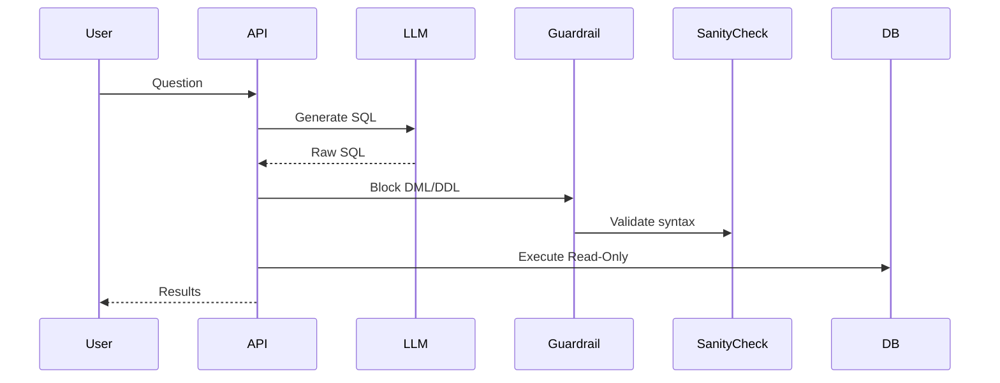

# Architecture: Text-to-SQL with Guardrails

## System Diagram
The following Mermaid.js sequence diagram maps the core workflow and interactions:

## Component Breakdown
- **Core Technology**: Python, SQLAlchemy, PostgreSQL
- **Design Paradigm**: Emphasizes high availability, fault tolerance, and security.
