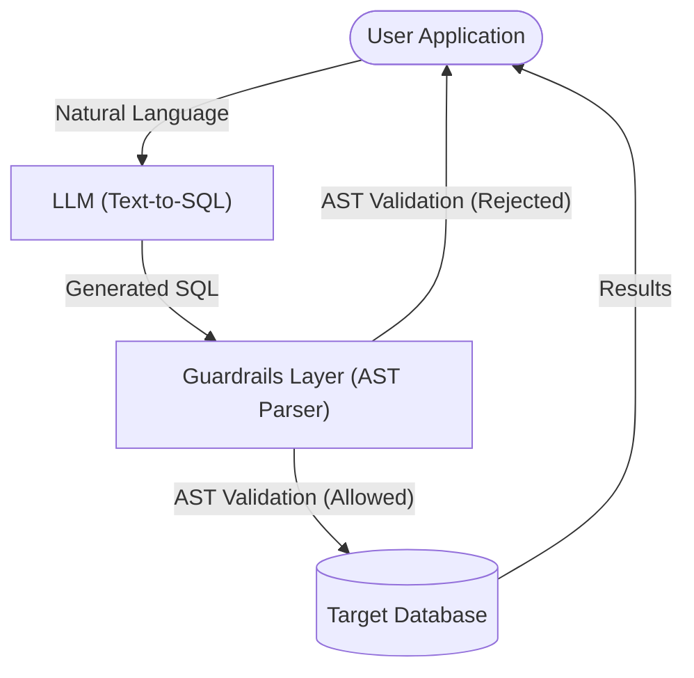

# Architecture — text-to-sql-guardrails
> Last updated: 2026-08-29 | Maturity: Full Prototype
> _Validation layer intercepting LLM-generated SQL._

## System Diagram
The following Mermaid.js sequence diagram maps the core workflow and interactions:

## Component Table

| Component | File | Responsibility | Tech |
|---|---|---|---|
| Validator | `src/validator.py` | Core engine checking AST structures | Python |
| Dialect Checks | `src/dialects.py` | Ensures query matches Postgres/MySQL | Python |

## Dependency Honesty Table

| Dependency | Status | Notes |
|---|---|---|
| SQLGlot (AST) | **Real** | Performs actual deep parsing of queries. |
| LLM | **Simulated** | E2E tests feed hardcoded bad queries instead of calling an LLM. |
| Target DB | **Simulated** | We only validate the query, we don't execute it. |
